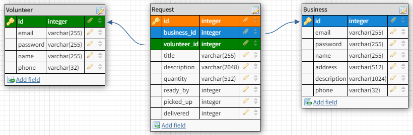

# Replate BackEnd

## Table of Contents

- [About](#about)
- [Schema](#schema)
- [Routes](#routes)
- - [Onboarding](#onboarding)
- - [Delivery Requests](#requests)
- - [Businesses](#businesses)
- - [Volunteers](#volunteers)

## About

Many businesses have leftover food at the end of the day. The Replate app makes it easy and inexpensive to get those leftovers to worthy partner organizations through a network of delivery volunteers.

## Schema

## Routes

### Onboarding
#### Register

|   Route   |         Input Data         | Expected Return |
| --------- | -------------------------- | --------------- |
|**POST** /api/auth/register/volunteer|{ email* password* name* phone* }|**Status: 201** (Created) { email name phone JWT token }|
|**POST** /api/auth/register/business|{email* password* name* address* description* phone*br>}|**Status: 201** (Created) { email name address description phone JWT token }|

#### Login

|   Route   |         Input Data         | Expected Return |
| --------- | -------------------------- | --------------- |
|**POST** /api/auth/login/volunteer|{ email password }|**Status: 200** (OK) { email name phone token: JWT token }|
|**POST** /api/auth/login/business|{ email password }|**Status: 200** (OK) { email name address description phone token: JWT token }|

### Delivery requests {#requests}
`{ Authorization: [JWT] }` must be sent in the header

|   Route   |         Input Data         | Expected Return |
| --------- | -------------------------- | --------------- |
|**GET** /api/requests||**Status: 200** (OK) [{ request objects }] (for current business/volunteer only)|
|**GET** /api/requests/all||**Status: 200** (OK) All [{ request objects }]|
|**GET** /api/requests/:id||**Status: 200** (OK) { object }|
|**DELETE** /api/requests/:id||**Status: 200** (OK) No body|

### Businesses
`{ Authorization: [JWT] }` must be sent in the header

|   Route   |         Input Data         | Expected Return |
| --------- | -------------------------- | --------------- |
|**POST** /api/auth/register/business|{email* password* name* address* description* phone* }|**Status: 201** (Created) { email name address description phone JWT token }|
|**PUT** /api/businesses/:id|{ any field(s) }|**Status: 200** (OK) { business object }|
|**DELETE** /api/businesses/:id \*\*||**Status: 200** (OK) No body|

\*\*Warning: Deleting businesses may render associated delivery requests invalid.

### Volunteers
`{ Authorization: [JWT] }` must be sent in the header

|   Route   |         Input Data         | Expected Return |
| --------- | -------------------------- | --------------- |
|**POST** /api/auth/register/volunteer|{ email* password* name* phone* }|**Status: 201** (Created) { email name phone JWT token }|
|**PUT** /api/volunteers/:id|{ any field(s) }|**Status: 200** (OK){ volunteer object }|
|**DELETE** /api/volunteers/:id||**Status: 200** (OK) No body|

